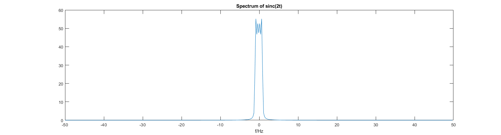

# SamplingVis
An attempt at making a teaching tool for visualizing the effects of various smpling frequencies (repetition of spectrum).

# Preface
I' tired of trying (and failing) to sketch the effects of varying sampling frequencies and the effect thereof on the repetitive nature of the spectrum. So this is an attempt at having a tool to visualize it.  
Yes, we'll use Matlab. But not in a strict sense (i.e. I'm not using Matlab to do some fancy math but rather as a visualization toolkit). Why? Because seeing all the numerically induced effects will probably only confuse students at this stage of learning.

## Things I don't want to see....
Generate a sinc and visualize its spectrum:
```
% generate and plot sinc (-2:2)
% do fft (of sinc - > we'd love to see a rectangular spectrum)
% plot result of fft (centered around f=0)
% see https://de.mathworks.com/help/matlab/math/fourier-transforms.html
Ts = 0.01;
t = -2:Ts:2;
fs = 1/Ts
x=sinc(t*2);
figure;plot(t,x),title('sinc(2t)'),xlabel('t')
n = length(x);
y = fft(x);
yshift = fftshift(y);
fshift = (-n/2:n/2-1)*(fs/n);
figure,plot(fshift,abs(yshift));
xlabel('f/Hz')
title('Spectrum of sinc(2t)')
```
Nice sinc.  
.png)  
Not so nice spectrum.... 
  
One could, of course, tweak parameters to obtain "nicer looks". But in the end that will only get you so far.. And since this is not about the effects of digital signal processing (yet) we don't want to see these effects.
